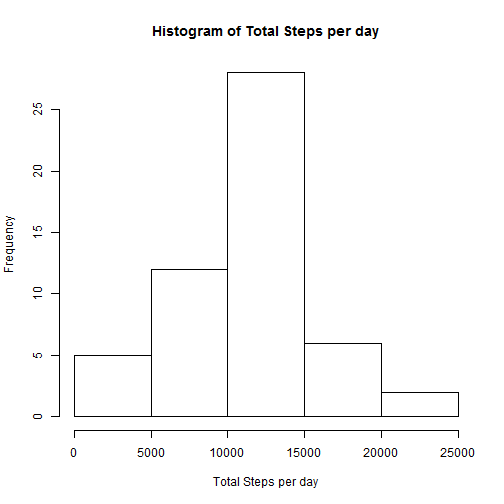
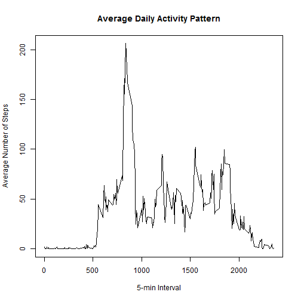
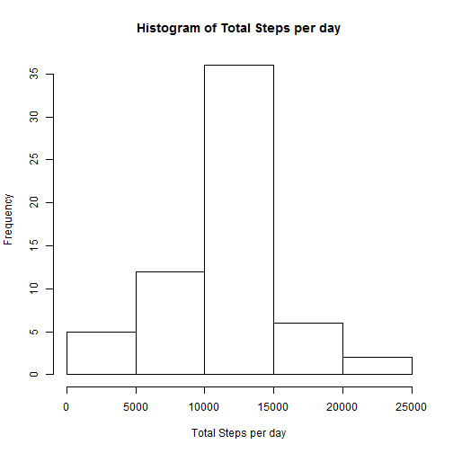
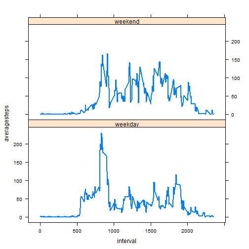

# Reproducible Research: Peer Assessment 1


## Loading and preprocessing the data

```r
## Load the data
activityData <- read.csv("activity.csv")

## Process/transform the data
activityData$date <- as.Date(activityData$date)
activityDataNAsRemoved <- na.omit(activityData)
```


## What is mean total number of steps taken per day?

```r
## Make a histogram of the total number of steps taken each day
stepsPerDay <- aggregate(activityData[,"steps"],list(activityData$date),sum)
names(stepsPerDay) <- c("date","totalsteps")

totalStepsPerDay <- as.numeric(na.omit(unlist(stepsPerDay$totalsteps)))

## draw a histogram
hist(totalStepsPerDay,
     main="Histogram of Total Steps per day",
     xlab="Total Steps per day")
```

 

```r
## mean total number of steps taken per day
mean(totalStepsPerDay)
```

```
## [1] 10766
```

```r
## median total number of steps taken per day
median(totalStepsPerDay)
```

```
## [1] 10765
```


## What is the average daily activity pattern?

```r
## Make a time series plot of the 5-minute interval (x-axis) and the average 
## number of steps taken, averaged across all days (y-axis)
stepsPerInterval <- aggregate(activityDataNAsRemoved[,"steps"],
                              list(activityDataNAsRemoved$interval), 
                              mean)
names(stepsPerInterval) <- c("interval","averagesteps")

x <- stepsPerInterval$interval
y <- stepsPerInterval$averagesteps

## draw a time series plot
plot.ts(x,y , type = "l", 
        xlab="5-min Interval", 
        ylab="Average Number of Steps", 
        main="Average Daily Activity Pattern")
```

 

```r
## 5-minute interval which contains the maximum number of steps,
## on average across all the days in the dataset
maxAverageSteps <- max(stepsPerInterval$averagesteps)
stepsPerInterval[stepsPerInterval$averagesteps == maxAverageSteps,"interval"]
```

```
## [1] 835
```

## Inputing missing values

```r
## total number of missing values in the dataset
nrow(activityData[!complete.cases(activityData),])
```

```
## [1] 2304
```

```r
## fill in all of the missing values in the dataset with mean for that 5-minute interval
updatedActivityData <- merge(x=activityData, 
                             y=stepsPerInterval, 
                             by="interval",
                             all.x = TRUE)

updatedActivityData[!complete.cases(updatedActivityData),"steps"] <- 
        updatedActivityData[!complete.cases(updatedActivityData),"averagesteps"]
updatedActivityData$date <- as.Date(updatedActivityData$date)

stepsPerDay <- aggregate(updatedActivityData[,"steps"],
                         list(updatedActivityData$date), 
                         sum)
names(stepsPerDay) <- c("date","totalsteps")
totalStepsPerDay <- as.numeric(na.omit(unlist(stepsPerDay$totalsteps)))

## draw a histogram
hist(totalStepsPerDay, 
     main="Histogram of Total Steps per day",
     xlab="Total Steps per day")
```

 

```r
## mean total number of steps taken per day
mean(totalStepsPerDay)
```

```
## [1] 10766
```

```r
## median total number of steps taken per day
median(totalStepsPerDay)
```

```
## [1] 10766
```

## Are there differences in activity patterns between weekdays and weekends?

```r
## function to compute day category - "weekday" and "weekend"
dayCategory <- function(dayName) { 
 if(dayName == "Saturday" | dayName == "Sunday")
   "weekend"
 else
   "weekday"
}

## Make a panel plot containing a time series plot of the 5-minute interval (x-axis) 
## and the average number of steps taken, 
## averaged across all weekday days or weekend days (y-axis)
library(lattice)
updatedActivityData$daycategory <- lapply(weekdays(updatedActivityData$date), 
                                          dayCategory)
updatedActivityData$daycategory <- factor(updatedActivityData$daycategory, 
                                          levels=c("weekday","weekend"))

stepsPerIntervalAndDayCategory <- aggregate(updatedActivityData[,"steps"],
                                            list(updatedActivityData$interval, 
                                                 updatedActivityData$daycategory),
                                            mean)
names(stepsPerIntervalAndDayCategory) <- c("interval","daycategory","averagesteps")

stepsPerIntervalAndDayCategory$averagesteps <- 
        as.numeric(stepsPerIntervalAndDayCategory$averagesteps)

## draw a panel lattice plot 
xyplot(averagesteps ~ interval | daycategory, 
       data = stepsPerIntervalAndDayCategory, 
       layout=c(1,2), 
       type="l", 
       lwd = 2)
```

 
